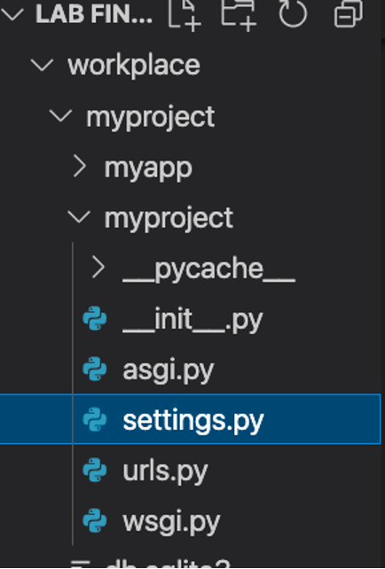
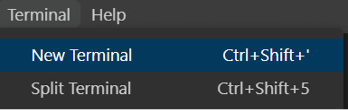
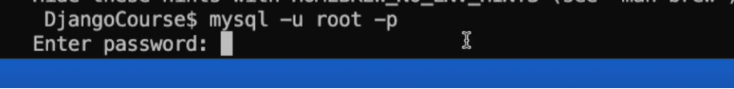
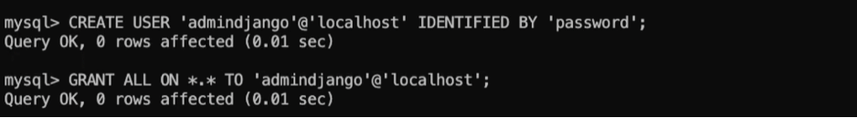
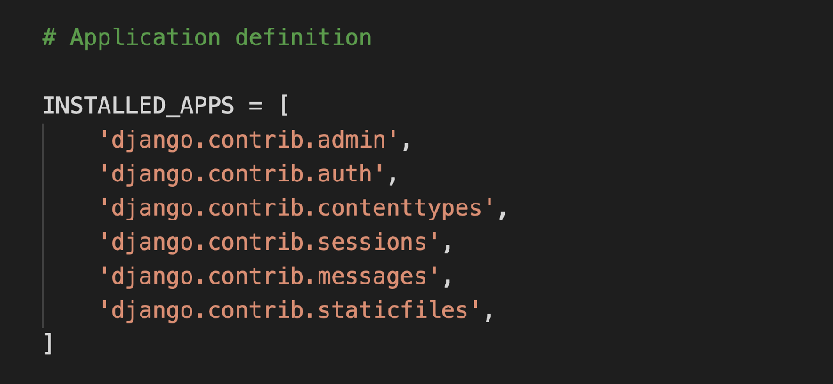
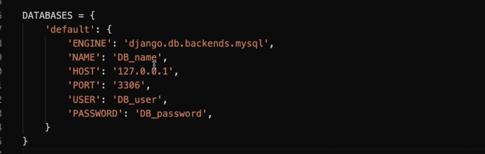

# Exercise: Connect the Little Lemon back-end to MySQL

## Lab assets

The zip file contains an updated template to be used along with supportive files to run the lab.

**Note**: **The virtual environment using `pipenv` has been added as a part of the zip file. You must activate the virtual environment and ensure dependencies are installed.**

Your goal is to create and connect to a MySQL database that can be used inside a Django project.

## Objectives

-   Create new MySQL database credentials

-   Update the project settings in Django to enable connection with MySQL

-   Migrate models and update the database table

## Introduction

In this lab, you will create and connect to an external MySQL database that can be used inside a Django project. You will migrate your models and populate data inside the database with the booking times available on the Little Lemon website.

To do this, you will have to create a booking option on the Little Lemon website inside the Django project using the JavaScript functionalities in the template and the MySQL database as the back-end. This is part one of the final assessment where you will be making the database connections.

## Initial lab instructions

This lab will require you to modify the following files:

`settings.py`



As well as `models.py`.

Additionally, you are required to use the command line console inside the VS Code terminal.

If not open already, go to `Terminal` on the Menu bar at the top of your screen and select `New Terminal`.



Before you begin this lab, you must activate the virtual environment.

You have already built the project named `myproject` and added an app inside the project called `myapp`.

Follow the instructions below and ensure you check the output at every step.

## Steps

**Note**: **Make sure you have installed MySQL on your local machine and set up the admin user. In this lab, to keep it simple, you are going to begin with the `root` user with credentials. The root user by default has the password which is either `password` or `<blank>`. In case of blank password, simply press `Enter`. Also, note that the password will not be visible on screen as it’s being typed.**

### Step 1:

First go to the command line or terminal on your local machine and login to the `mysql` shell by typing the command:

```sh
mysql -u root -p
```

Press Enter and enter the password when prompted.

**Note**: Depending on the local machine, in some cases you may have to provide admin privileges for this command. This can be done by adding the keyword sudo before the command. For example:

```sh
sudo mysql -u root -p
```

### Step 2:

Create a database with the name `reservations` with the command below:

```sql
CREATE DATABASE reservations;
```

**Note**: The commands in MySQL should end with a semi-colon (;).

### Step 3:

Next, you need to verify that the database has been created by typing the command:

```sh
SHOW DATABASES;
```

The output will depend on the databases present on your local machine. Confirm that it includes the database you have created.

### Step 4:

Now open VS Code and open the `Terminal` inside it. Navigate to the project directory of your Django project and enable `pipenv` virtual environment for the project.

**Note**: Ensure the `Pipfile` created by `pipenv` command is updated with `mysqlclient` and Django package installations along with the other dependencies specific to your local machine, for running the project.

### Step 5:

In the terminal, run the command that will enable access to `mysql` and enter the `mysql` shell by passing the `-u` and `-p` flags that will enable the MySQL console to prompt for a password.



**Note**: The default password set for mysql here should be the same as the one set for `root` user on your local machine.

### Step 6:

Run the command to show databases and ensure the `reservations` database you have created is present in the list of databases.

### Step 7:

Create a new user for the database by running the following command:

```sql
CREATE USER 'admindjango'@'localhost' IDENTIFIED BY 'employee@123!';
```

### Step 8:

Run the following command to grant all permissions to the user you have created:

```sql
GRANT ALL ON *.* TO 'admindjango'@'localhost';
```



**Note**: The full privileges are assigned here, but it is not the ideal practice in production environments.

### Step 9:

Run the command to flush all the privileges.

**Note**: Privileges assigned using `GRANT` command do not require the flush privileges but it is usually a good practice to run this command while you are using variable commands for changing privileges and reloading the server and grant tables containing information about user accounts.

### Step 10:

Run the command to exit the `mysql` shell.

**Note**: Once inside the Django shell, make sure the `pipenv` virtual environment is still active. You can observe the round brackets such as (`myproject`) as a suffix inside your VS Code prompt.

### Step 11:

Inside your Django project, open the `settings.py` file and go to the `INSTALLED_APPS` configuration.

Add the name of your Django app `myapp` to the list.



**Note**: Make sure you add a comma(,) after the string.

### Step 12:

Now search for the configuration labeled `DATABASES` and update the configuration. Select the values assigned to it by default and replace them with the following code:



### Step 13:

After you enter the values and your code is the same as seen in the screenshot above, replace the values for the following:

| NAME:     | ‘reservations’             |
| --------- | -------------------------- |
| USER:     | 'admindjango'              |
| PASSWORD: | 'employee@123!'            |
| ENGINE    | 'django.db.backends.mysql' |

Save the `settings.py` file.

### Step 14:

In the Terminal, run the command to make migrations. Make sure you are inside the directory that contains `manage.py` file.

### Step 16:

Open the file `models.py` and take note of the code already added for creating a model named `Booking`.

### Step 17:

Run both of the commands to perform the migration.

The migrations will create the `Booking` table that can be seen from the MySQL extension installed inside your VS Code.

### Step 18:

Run the command to enter the `mysql` shell again and enter the credentials requested.

Once inside the `mysql` shell, run a command to see the `Booking` table you have created. You can do this by typing the command:

```sh
use reservations;
```

Add a second command next:

```sh
show tables;
```

You can observe all the different tables that Django created after the migrate command. The main table that you will be dealing with from the list is the `myapp_booking`.

To see the details of this table, type the command:

`describe myapp_booking;`

You will be able to note all the fields that have been added inside the table generated from the model.

**Note**: You will not see any entries in the table as it is empty and will need to be updated.

## Conclusion

This was part one of your final assessment. You practiced connecting your Django application to a MySQL database and created a database from the model. You will be using this model to update the template in the next part of the assessment.
